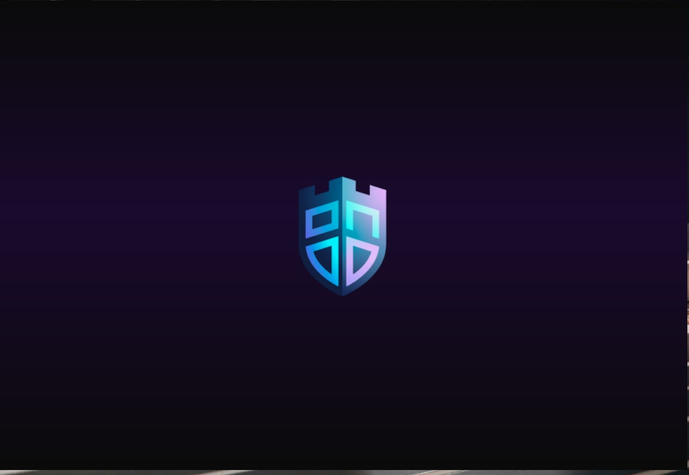
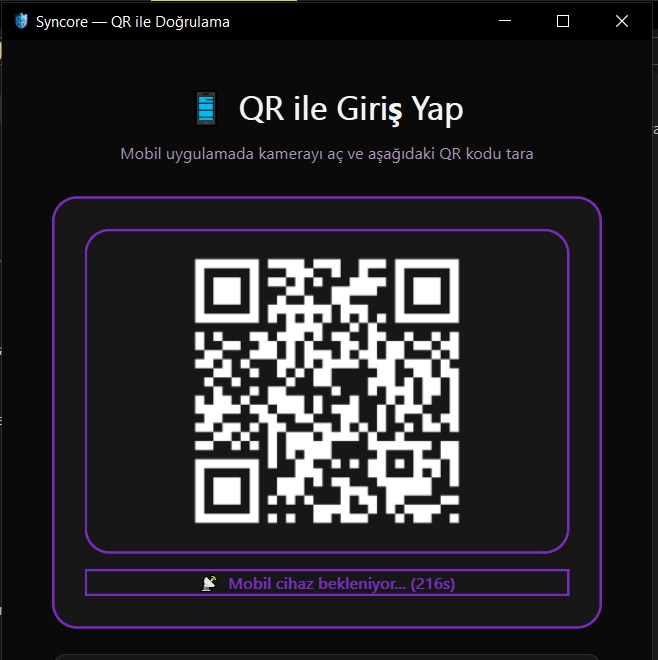
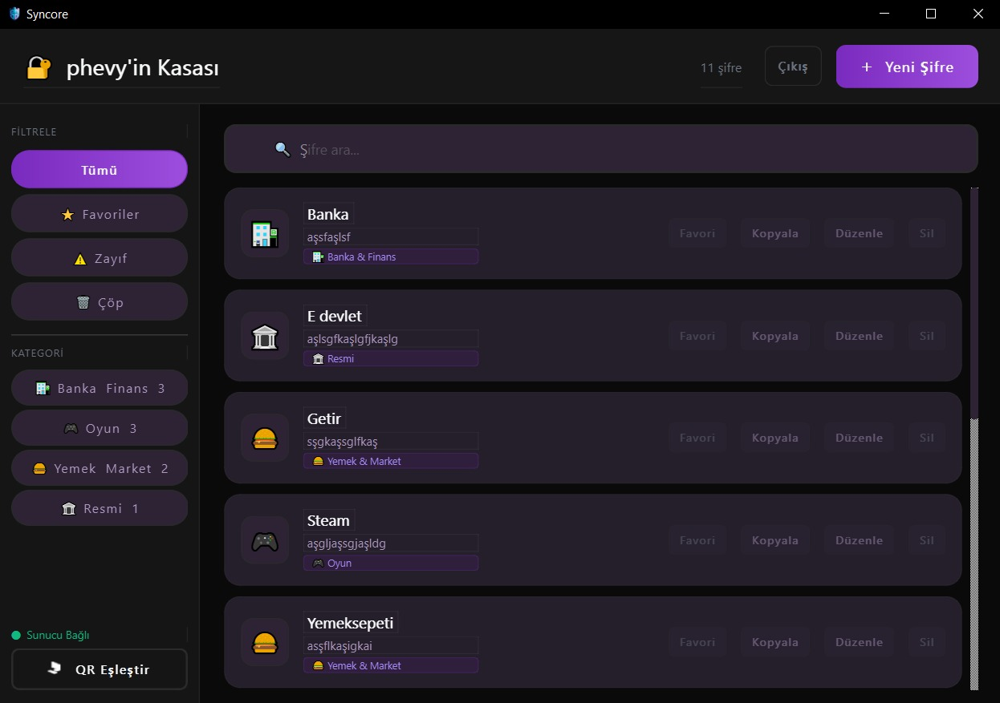
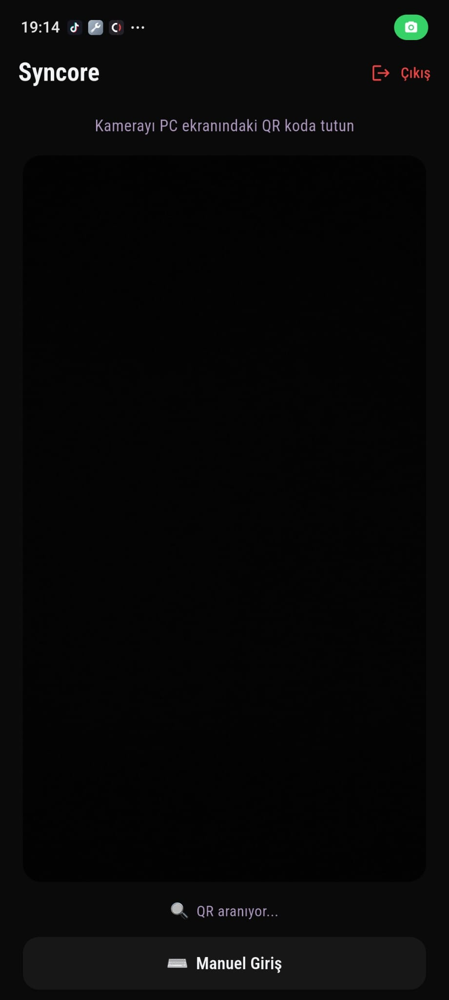
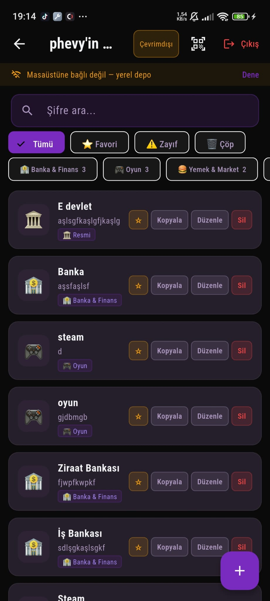

<div align="center">

# Syncore

**Secure Password Vault with QR-Based Two-Factor Authentication**

[](https://python.org)
[](https://pypi.org/project/PyQt6/)
[](https://flutter.dev)
[]()
[]()
[]()

---

🇬🇧 [English](#english) &nbsp;|&nbsp; 🇹🇷 [Türkçe](#türkçe)

</div>

---

<a name="english"></a>
# 🇬🇧 English

## Overview

Syncore is a secure, offline-first password vault with QR-based two-factor authentication. The desktop application (Windows) stores and manages passwords encrypted with AES-256-GCM. The mobile client (Android) acts as a 2FA authenticator — every session requires a QR scan from the mobile device before the vault is unlocked.

> **Graduation Project** — Computer Engineering Department, 2026

---

## Screenshots

### Desktop
| Splash | QR Screen | Vault |
|:---:|:---:|:---:|
|  |  |  |

### Mobile
| QR Screen | Vault |
|:---:|:---:|
|  |  |

---

## Features

### Security
- **AES-256-GCM** encryption for every password entry
- **HMAC-SHA256** challenge-response 2FA over local network
- **Argon2id** key derivation (resistant to GPU/ASIC brute-force)
- **TOFU** (Trust On First Use) pairing — no pre-shared secrets needed
- Vault never unlocks without mobile approval
- Master password is never stored — only its Argon2 hash

### Desktop App
- QR-based login — scan once per session
- Card-based password list with inline search
- Auto-categorization (18 categories: Social, Banking, Email, Gaming…)
- Weak password detection with visual badges
- Favorites and Trash with restore support
- Dark glassmorphism theme with custom title bars
- Splash screen with branded background
- Logout returns to QR screen (session isolation)

### Mobile App
- QR scanner for desktop pairing
- Instant sync on connect, 1s lightweight poll + 15s full sync
- Category and strength filters
- Offline mode — local SQLite cache when desktop is unreachable
- Native Android splash screen and app icon

### Synchronization
- Bidirectional sync with UUID-based last-modified-wins conflict resolution
- Tombstone system — deleted entries propagate to both sides
- 30-day tombstone retention policy
- Thread-safe mutex on both desktop (Python `threading.Lock`) and mobile (Dart Future chain)

---

## Tech Stack

| Layer | Technology |
|---|---|
| Desktop UI | PyQt6 (Python) |
| Desktop Storage | SQLite via `sqlite3` |
| Desktop Crypto | `cryptography` (AES-256-GCM), `argon2-cffi` |
| Desktop Server | Raw TCP with length-prefix framing (port 8765) |
| Mobile UI | Flutter / Dart |
| Mobile Storage | `sqflite` |
| Mobile Scanner | `mobile_scanner` |
| Transport | TCP + JSON, HMAC-SHA256 auth |

---

## Architecture

```
┌─────────────────────────────────┐        ┌────────────────────────────┐
│        Desktop (Windows)        │        │      Mobile (Android)      │
│                                 │        │                            │
│  Splash → QR Screen             │        │  Splash → Vault Screen     │
│     ↓                           │        │       ↓                    │
│  Mobile scans QR                │◄──TCP──►  QR Scanner               │
│     ↓                           │  8765  │       ↓                    │
│  HMAC Challenge-Response        │        │  Auth (HMAC-SHA256)        │
│     ↓                           │        │       ↓                    │
│  Vault Unlocked                 │◄──────►│  Sync (UUID + tombstones) │
│  (AES-256-GCM SQLite)           │        │  (sqflite cache)           │
└─────────────────────────────────┘        └────────────────────────────┘
```

**Authentication flow:**
1. Desktop displays a QR code encoding `pvault://<ip>:8765?user=<username>`
2. Mobile scans QR and opens TCP connection
3. Desktop sends a random 32-byte challenge
4. Mobile responds with `HMAC-SHA256(shared_secret, challenge)`
5. Desktop verifies — on success, vault is unlocked and CRUD session begins

---

## Requirements

### Desktop
- Windows 10 / 11
- Python 3.10+
- Dependencies: `pip install -r desktop/requirements.txt`

### Mobile
- Android 5.0+ (API 21+)
- Same local network as the desktop

---

## Installation

### Desktop (from source)
```bash
git clone https://github.com/yourusername/syncore.git
cd syncore/desktop
pip install -r requirements.txt
python main.py
```

### Desktop (installer)
Run `SyncoreSetup.exe` — installs to Program Files, creates Start Menu shortcut. No Python required.

### Mobile (APK)
Transfer `Syncore.apk` to the Android device and install.  
*(Enable "Install from unknown sources" in device settings if needed)*

---

## Project Structure

```
syncore/
├── desktop/
│   ├── main.py                 # App entry point, splash, auth flow
│   ├── network_server.py       # TCP server, challenge-response, CRUD handlers
│   ├── vault_storage.py        # AES-256-GCM SQLite vault, sync logic
│   ├── crypto_manager.py       # Argon2, AES-GCM, HMAC primitives
│   ├── session_manager.py      # Persistent login session
│   ├── requirements.txt
│   ├── assets/
│   │   ├── icon/logo.ico
│   │   └── splash/splash.png
│   └── ui/
│       ├── styles.py           # Dark theme, color palette
│       ├── manager_window.py   # Main vault UI, cards, categories
│       ├── tfa_waiting_window.py
│       └── login_window.py
│
├── mobile_flutter/
│   ├── lib/
│   │   ├── main.dart
│   │   ├── screens/
│   │   │   ├── vault_screen.dart   # Main screen, sync, filters
│   │   │   └── auth_screen.dart    # QR scan, connect, auth
│   │   └── services/
│   │       ├── vault_service.dart  # TCP session, mutex, protocol
│   │       └── storage_service.dart
│   └── assets/
│       ├── icon/logo.png
│       └── splash/
│
├── Syncore.apk
└── README.md
```

---

## Security Notes

| Property | Implementation |
|---|---|
| Vault encryption | AES-256-GCM (AEAD — confidentiality + integrity) |
| Key derivation | Argon2id — time=3, mem=64MB, threads=4 |
| 2FA transport | HMAC-SHA256 over local TCP |
| Nonce | 96-bit random per entry — no reuse |
| Master password | Never stored — Argon2 hash only |
| Sync conflict | UUID + UTC timestamp, last-modified-wins |
| Thread safety | `threading.Lock` (Python) + Future chain mutex (Dart) |

> **Note:** This system is designed for local network use. The desktop machine acts as the server; the mobile device must be on the same network.

---

## Credits

**Author:** [Your Name]  
**University:** [University Name]  
**Department:** Computer Engineering  
**Year:** 2026

---

<a name="türkçe"></a>
# 🇹🇷 Türkçe

## Genel Bakış

Syncore, QR tabanlı iki faktörlü kimlik doğrulama sistemine sahip, güvenli ve çevrimdışı öncelikli bir şifre kasasıdır. Masaüstü uygulama (Windows) şifreleri AES-256-GCM ile şifreleyerek saklar. Mobil istemci (Android) 2FA doğrulayıcısı olarak çalışır — kasaya erişmek için her oturumda mobil cihazdan QR okutmak zorunludur.

> **Bitirme Projesi** — Bilgisayar Mühendisliği Bölümü, 2026

---

## Ekran Görüntüleri

### Masaüstü
| Açılış Ekranı | QR Ekranı | Kasa |
|:---:|:---:|:---:|
|  |  |  |

### Mobil
| QR Ekranı | Kasa |
|:---:|:---:|
|  |  |

---

## Özellikler

### Güvenlik
- Her şifre kaydı için **AES-256-GCM** şifreleme
- Yerel ağ üzerinden **HMAC-SHA256** challenge-response 2FA
- GPU/ASIC kaba kuvvet saldırılarına dayanıklı **Argon2id** anahtar türetme
- **TOFU** (İlk Kullanımda Güven) eşleştirme — önceden paylaşılan anahtar gerekmez
- Mobil onayı olmadan kasa açılmaz
- Ana parola hiçbir zaman saklanmaz — yalnızca Argon2 hash'i tutulur

### Masaüstü Uygulama
- Oturum başına bir kez QR okutma zorunluluğu
- Kart tabanlı şifre listesi ve anlık arama
- Otomatik kategorizasyon (18 kategori: Sosyal Medya, Bankacılık, E-posta, Oyun…)
- Görsel rozetlerle zayıf şifre tespiti
- Favoriler ve geri alınabilir Çöp Kutusu
- Özel başlık çubukları ile koyu cam efekti tema
- Marka kimliğine uygun açılış ekranı
- Çıkış yapınca QR ekranına dönüş (oturum izolasyonu)

### Mobil Uygulama
- Masaüstü ile eşleştirme için QR tarayıcı
- Bağlanırken anlık senkronizasyon, 1s hafif yoklama + 15s tam senkronizasyon
- Kategori ve şifre güçlülüğü filtreleri
- Çevrimdışı mod — masaüstüne ulaşılamazken yerel SQLite önbelleği
- Native Android açılış ekranı ve uygulama ikonu

### Senkronizasyon
- UUID tabanlı son değişiklik kazanır çakışma çözümü ile çift yönlü senkronizasyon
- Tombstone sistemi — silinen kayıtlar her iki tarafa yayılır
- 30 günlük tombstone saklama politikası
- Masaüstünde `threading.Lock`, mobilde Dart Future zinciri ile thread güvenliği

---

## Teknoloji Yığını

| Katman | Teknoloji |
|---|---|
| Masaüstü Arayüz | PyQt6 (Python) |
| Masaüstü Depolama | `sqlite3` ile SQLite |
| Masaüstü Şifreleme | `cryptography` (AES-256-GCM), `argon2-cffi` |
| Masaüstü Sunucu | Uzunluk önekli ham TCP (port 8765) |
| Mobil Arayüz | Flutter / Dart |
| Mobil Depolama | `sqflite` |
| Mobil QR Tarayıcı | `mobile_scanner` |
| İletişim | TCP + JSON, HMAC-SHA256 kimlik doğrulama |

---

## Mimari

```
┌─────────────────────────────────┐        ┌────────────────────────────┐
│        Masaüstü (Windows)       │        │      Mobil (Android)       │
│                                 │        │                            │
│  Açılış → QR Ekranı             │        │  Açılış → Kasa Ekranı      │
│     ↓                           │        │       ↓                    │
│  Mobil QR okur                  │◄──TCP──►  QR Tarayıcı              │
│     ↓                           │  8765  │       ↓                    │
│  HMAC Challenge-Response        │        │  Kimlik Doğrulama          │
│     ↓                           │        │       ↓                    │
│  Kasa Açılır                    │◄──────►│  Senkronizasyon            │
│  (AES-256-GCM SQLite)           │        │  (sqflite önbelleği)       │
└─────────────────────────────────┘        └────────────────────────────┘
```

**Kimlik doğrulama akışı:**
1. Masaüstü, `pvault://<ip>:8765?user=<kullanıcıadı>` içeren QR kodu gösterir
2. Mobil QR'ı tarar ve TCP bağlantısı açar
3. Masaüstü rastgele 32 byte'lık bir challenge gönderir
4. Mobil, `HMAC-SHA256(shared_secret, challenge)` ile yanıt verir
5. Masaüstü doğrular — başarılı ise kasa açılır ve CRUD oturumu başlar

---

## Gereksinimler

### Masaüstü
- Windows 10 / 11
- Python 3.10+
- Bağımlılıklar: `pip install -r desktop/requirements.txt`

### Mobil
- Android 5.0+ (API 21+)
- Masaüstü ile aynı yerel ağ

---

## Kurulum

### Masaüstü (kaynak koddan)
```bash
git clone https://github.com/yourusername/syncore.git
cd syncore/desktop
pip install -r requirements.txt
python main.py
```

### Masaüstü (kurulum dosyası)
`SyncoreSetup.exe`'yi çalıştırın — Program Files'a kurar, Başlat Menüsüne kısayol ekler. Python gerekmez.

### Mobil (APK)
`Syncore.apk`'yı Android cihaza aktarın ve yükleyin.  
*(Gerekirse cihaz ayarlarından "Bilinmeyen kaynaklardan yükleme"ye izin verin)*

---

## Proje Yapısı

```
syncore/
├── desktop/
│   ├── main.py                 # Uygulama giriş noktası, açılış ekranı, auth akışı
│   ├── network_server.py       # TCP sunucu, challenge-response, CRUD işleyicileri
│   ├── vault_storage.py        # AES-256-GCM SQLite kasası, sync mantığı
│   ├── crypto_manager.py       # Argon2, AES-GCM, HMAC ilkelleri
│   ├── session_manager.py      # Kalıcı oturum yönetimi
│   ├── requirements.txt
│   ├── assets/
│   │   ├── icon/logo.ico
│   │   └── splash/splash.png
│   └── ui/
│       ├── styles.py           # Koyu tema, renk paleti
│       ├── manager_window.py   # Ana kasa arayüzü, kartlar, kategoriler
│       ├── tfa_waiting_window.py
│       └── login_window.py
│
├── mobile_flutter/
│   ├── lib/
│   │   ├── main.dart
│   │   ├── screens/
│   │   │   ├── vault_screen.dart   # Ana ekran, senkronizasyon, filtreler
│   │   │   └── auth_screen.dart    # QR tarama, bağlantı, kimlik doğrulama
│   │   └── services/
│   │       ├── vault_service.dart  # TCP oturumu, mutex, protokol
│   │       └── storage_service.dart
│   └── assets/
│       ├── icon/logo.png
│       └── splash/
│
├── Syncore.apk
└── README.md
```

---

## Güvenlik Notları

| Özellik | Uygulama |
|---|---|
| Kasa şifreleme | AES-256-GCM (AEAD — gizlilik + bütünlük) |
| Anahtar türetme | Argon2id — time=3, mem=64MB, thread=4 |
| 2FA taşıma | Yerel TCP üzerinden HMAC-SHA256 |
| Nonce | Kayıt başına 96-bit rastgele — tekrar kullanım yok |
| Ana parola | Hiçbir zaman saklanmaz — yalnızca Argon2 hash |
| Sync çakışması | UUID + UTC zaman damgası, son değişiklik kazanır |
| Thread güvenliği | `threading.Lock` (Python) + Future zinciri mutex (Dart) |

> **Not:** Bu sistem yerel ağ kullanımı için tasarlanmıştır. Masaüstü sunucu görevi üstlenir; mobil cihazın aynı ağda olması gerekir.

---


<div align="center">

*Syncore — Güvenli, yerel, gizlilik odaklı.*

</div>
